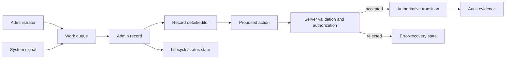

# Admin operations UI domain model and glossary

- Status: Living document
- Last updated: 2026-08-21
- Source of truth for persisted fields: `src/lib/db/schema.ts`
- Access boundary: `src/app/admin/layout.tsx` and server-side authorization in each operation

This document defines shared product, design, and engineering language for the implemented `/admin` visual system. It does not grant capabilities or replace schema, validation, authorization, payment, enrollment, or audit contracts.

## Relationship map

The transition path is protected. A selected row, optimistic badge, client role check, modal confirmation, uploaded preview, or success toast is not authority for a role, enrollment, payment, refund, publication, or certificate transition.

## Actors and authority

### Administrator

An authenticated user whose server-authoritative role is `admin`. The UI may adapt navigation and task presentation, but it cannot establish admin authority.

### Operator

The human currently performing an admin task. “Operator” describes the interaction role and does not introduce a new persisted user role.

### Affected user

A learner, instructor, or administrator whose account, access, enrollment, payment record, certificate, or content relationship may change because of an authorized admin operation.

## Operational objects

### Admin record

A domain object shown for inspection or management, such as a user, course, lesson, enrollment, payment, reconciliation item, coupon, certificate, post, media object, announcement, review, or setting. Its displayed state must come from an authoritative source.

### Work queue

An ordered set of records that require attention, review, recovery, or a decision. A work queue prioritizes exceptions and next actions rather than promotional summaries.

### Record list

A searchable, filterable, sortable, and possibly selectable collection of Admin records. A Record list owns density, column meaning, pagination, loading, empty, error, and overflow behavior.

### Record detail/editor

The surface for inspecting one Admin record, its relationships, editable fields, lifecycle state, evidence, and permitted actions. Read-only evidence and mutable controls must be visually distinct.

### Authoritative status

A status read from or derived by the server according to current domain contracts. Status color and wording are presentation; neither can change the underlying state.

### Authoritative transition

A server-authorized mutation from one valid state to another, such as publishing a course, changing a permitted user lifecycle state, completing a verified manual-payment review, refunding an eligible payment, or explicitly granting an enrollment. The UI proposes the action and renders the response; it does not decide truth.

### Proposed action

An operator's requested mutation before server validation succeeds. It remains pending until the authoritative response is returned.

### Destructive action

An action that deletes, revokes, archives, refunds, disables, invalidates, or otherwise makes data or access difficult to recover. It requires unambiguous object identity, consequence language, permission checks, and confirmation proportional to impact.

### Bulk action

One Proposed action applied to a reviewed set of records. Selection count, scope, excluded records, partial failure, retry, and final outcomes must remain visible. A visual selection is not evidence that every mutation succeeded.

### Audit evidence

The durable actor, time, target, action, and outcome context available for an operation. UI activity copy or a toast is not a substitute for persisted audit evidence.

### System signal

An authoritative count, threshold, health state, or exception that may create work. Hard-coded percentages, notification counts, or decorative charts are not System signals.

### Operational metric

A sourced and correctly labelled value used to understand operations. Its time window, unit, comparison basis, and empty/unavailable state must be explicit. A fabricated trend is not an Operational metric.

## Experience surfaces

### Admin surface

Every route under `/admin`. Its primary job is to help an authorized operator understand state, choose the next safe action, perform it efficiently, and verify the outcome.

### Brand-aligned operations UI

The proposed admin visual system. It shares MilerDev semantic tokens, typography, accessible primitives, status meanings, and interaction quality while owning denser layouts and stronger operational safeguards than public or learner surfaces.

### Admin shell

The shared sidebar, header, global context, page container, navigation, responsive drawer, user identity, and route title. Global shell controls must either work, be clearly unavailable, or be absent.

### Overview surface

A read-oriented surface such as the dashboard or analytics summary. It shows only authoritative metrics and exceptions, with time windows and unavailable states made explicit.

### Content operations surface

Course, lesson, media, blog, bundle, tag, announcement, affiliate-banner, and review workflows. It emphasizes draft/published/archive truth, ordering, preview, validation, and safe publication.

### People operations surface

User, enrollment, and certificate workflows. It emphasizes identity, role, access, explicit admin intent, affected relationships, and audit context.

### Commerce operations surface

Payment, reconciliation, coupon, and financial reporting workflows. It emphasizes THB precision, provider truth, status history, evidence, idempotency, refund/retry rules, and explicit outcomes.

### System operations surface

Settings, audit logs, reports, and integration or health context. It emphasizes scope, effect, recency, provenance, and recovery.

## UI patterns

### Operational primitive

An accessible source-owned primitive configured for admin density and states, such as Button, Input, Select, Dialog, AlertDialog, Sheet, Tabs, Badge, Table foundation, Skeleton, or toast.

### Admin pattern

A repeatable composition with operational meaning, such as RecordTable, FilterBar, WorkQueueCard, StatusHistory, LifecycleActions, BulkActionReview, EvidencePanel, or AuditContext.

### Density variant

A documented spacing and control-size variant for data-heavy admin work. Density must preserve target size, focus visibility, Thai readability, and error comprehension.

### Risk tone

A semantic presentation of informational, success, warning, error, destructive, or neutral state. Risk tone follows domain meaning and never substitutes for text labels.

### Mutation pending state

The interval after an operator proposes an action and before the authoritative response arrives. Relevant controls are protected from duplicate submission, and the UI does not claim success early.

### Partial failure

A result in which only part of a bulk or multi-step action succeeds. Successful and failed targets, reasons, retry eligibility, and final authoritative states remain distinguishable.

### Permission-denied state

The result of a server authorization rejection. It must not be presented as a generic empty or transient loading state.

### Honest unavailable state

Presentation used when a metric, search capability, notification feed, comparison basis, or integration is not implemented or cannot be sourced. It replaces simulated values and inactive affordances.

## Migration language

### Admin visual convergence

The staged replacement of fragmented admin styling with shared MilerDev foundations and admin-specific operational patterns. It is not authorization to redesign domain rules.

### Operations v2 route surface

The versioned content surface applied by src/app/admin/layout.tsx to every Admin route. It normalizes page-header hierarchy, content rhythm, surfaces, native controls, focus states, tables, dialogs, shadow restraint, and responsive stacking. It is an accepted shared Admin pattern, not merely the surrounding navigation shell, and is identified by data-admin-visual-system="operations-v2".

### Representative route

A route selected to validate a reusable pattern before broad migration. Dashboard and Courses were the first representatives for authoritative overview states and list/table/content-operation density.

### Migrated admin route

An admin route whose representative states use the accepted foundation, preserve behavior and authority boundaries, expose no misleading affordances, and pass relevant verification.

The shared Admin shell alone does not satisfy this definition. The route's own list, detail, editor, forms, dialogs, status mappings, feedback, and responsive states must converge.

### Exempt admin route

An Admin route with no independent content surface to migrate, such as an intentional redirect. Exempt routes are documented explicitly and are not counted as migrated UI.

### Remaining admin route

An Admin content route that still depends on page-local presentation, raw status/color mappings, embedded style blocks, or legacy compositions even if it is already rendered inside the new Admin shell.

### Route family

A set of Admin routes that participate in one operational journey and reuse authority boundaries and interaction patterns. Course index, course editor, lesson ordering, lesson editor, and course-scoped enrollments are one Route family even though they are separate URLs.

### Vertical migration slice

Migration of an end-to-end Route family through its list, detail/editor, proposed actions, authoritative responses, recovery states, responsive behavior, and regression checks. A Vertical migration slice is complete only when operators do not fall back into a legacy surface during the primary journey.

### Admin migration ledger

The route inventory used to distinguish migrated, exempt, and remaining surfaces. As of the correction audit on 2026-08-21 it records 27 routes: 26 content routes implemented on the Operations v2 route surface, 1 exempt redirect, and no unhandled source route. Signed-in browser comparison remains pending before the rollout is called production-verified.

### Behavior contract

The observable permissions, validation, state transitions, recovery, idempotency, navigation, and data presentation that must survive the visual migration. CSS class names and component nesting are not behavior contracts unless explicitly tested as integration hooks.

## Non-negotiable invariants

- `auth()` and server authorization remain authoritative for admin access.
- Visual state, client role checks, confirmations, and optimistic updates do not establish domain truth.
- Enrollment requires verified payment or explicit authorized admin intent.
- Stripe, SlipOK, webhook, reconciliation, coupon, and retry protections remain intact.
- Payment amounts remain THB and decimal values remain strings at database boundaries where required.
- Publication, archive, user lifecycle, certificate, upload, and settings validation remain intact.
- Every displayed metric or notification is sourced, derived transparently, or represented as unavailable.
- Thai text remains valid UTF-8; task, status, validation, recovery, and destructive language is Thai-first.
