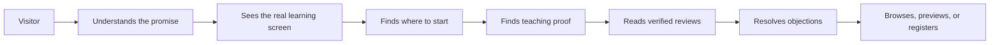

# Home conversion domain and section glossary

- Status: Accepted living document
- Last updated: 2026-10-07
- Related decisions: `docs/adr/0012-home-shows-the-real-product.md` (section order), `docs/adr/0002-home-information-architecture-and-spacing-rhythm.md` (spacing and admission rule)

## Journey model

Home supports this journey; it does not need to explain every product detail that belongs on a course page.

## Section roles

### Hero promise

The fastest explanation of who MilerDev is for, what practical change the learner can expect, and the next useful action. It is not a complete company introduction.

### Hero facts

Three short capability claims under the hero actions: free preview without an account, one payment with lifetime access, and a certificate on completion. Like every capability claim, they must stay true for the actual product and are not social-proof statistics. They replace the retired confidence strip.

### Hero editor

A decorative code editor that types a short program and then shows its working result. It illustrates building, not a product state: it never shows a learner's progress, a score, or a lesson that does not exist.

### How you learn

Screenshots of the real learning workspace with one plain sentence each. A capability appears only when a learner could meet it, so the practice-quiz card waits until a published course has a quiz.

### Learning path

A real route through available products for a learner goal. On Home it is the ordered list of course slugs in `src/lib/home/course-plan.ts`; each step is a real course page. A path needs at least two published steps. A label that sends every learner to the same generic catalog is a marketing topic, not a product path.

### Extra course

A published course outside the learning path, listed after it so no course disappears from Home.

### Latest product

One of the four most recently created published courses, shown only when the learning path has fewer than two published steps. Cards use real price, active promotion, preview, instructor, lesson, duration, and tag data. Latest is not the same as manually featured.

### Studio proof

Evidence that connects MilerDev Studio's teaching approach and software experience to real teaching activity. The current proof is a static three-image collage with descriptive alternative text, and an instructor card: the founder's name and role, and the YouTube channel's subscriber and video counts, rounded down from the public channel page (196K and 3.7K on 2026-10-07, shown as "กว่า 190,000" and "กว่า 3,700") so the claim stays true. Recheck the channel before changing those numbers. It is not a gallery product or testimonial.

### Learner outcome proof

A verified review, learner project, or case study that shows a result attributable to an actual learner. Anonymous invented testimonial copy is not learner outcome proof. Home shows up to three verified, visible reviews rated 4 or 5 with a written comment, named as the course page names them, and leaves the section out when there are none.

### Canonical FAQ

The shared pre-purchase answer set used by Home and the full FAQ page. Home currently admits five questions covering prerequisites, access duration, certificates, payment methods, and access after payment.

### Objection

A reason a suitable visitor may delay action, such as missing prerequisites, uncertainty about access duration, payment methods, certificates, preview availability, or support.

### Final action

The single most useful next step after the page has established fit and trust. For the current MilerDev release this is browsing courses; registration is secondary.

## Spacing language

### Section block spacing

The vertical breathing room between a section boundary and its content. It defines page rhythm and must not be confused with gaps between child elements.

### Section header gap

The distance between the section's heading and copy cluster and its primary cards, media, or controls.

### Content gap

The repeatable distance between sibling cards or content groups inside a section.

### Page gutter

The minimum horizontal space between viewport edges and readable content. The shared container owns only this inline spacing; sections own their block spacing.

### Compact evidence strip

A deliberately short section used for concise, credible capabilities or evidence. It is not permission to collapse typography, tap targets, or mobile gutters.

## Invariants

- Do not show fabricated, ambiguous, or capped-query statistics as social proof.
- Do not publish a learning path without a real destination.
- Do not invent reviews, projects, partners, or instructor claims.
- Home CTAs must resolve to an existing truthful flow.
- Fix spacing at the cascade and token level before applying local exceptions.
- Mobile spacing may be smaller than desktop spacing, but it must remain intentional and measurable.
- The shared container must not reset vertical padding utilities.
