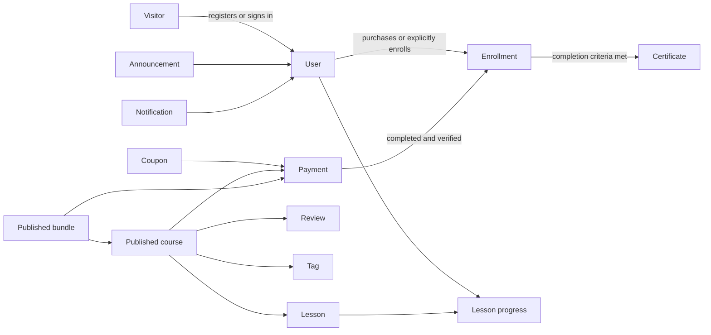

# User-facing redesign domain model and glossary

- Status: Living document
- Last updated: 2026-08-20
- Source of truth for persisted fields: `src/lib/db/schema.ts`

This document gives design and engineering a shared language. It describes current domain boundaries; it does not replace the database schema or authorization code.

## Relationship map

The arrow from Payment to Enrollment is a protected business transition. A client-side success screen is not proof of payment and must never grant access by itself.

## Actors

### Visitor

A person without an authenticated session. A Visitor can browse published content and free previews. A Visitor must authenticate before enrollment or purchase; the return URL should preserve their intended course or bundle.

### Student / learner

The default authenticated user role in the schema is `student`. “Learner” is the preferred product-language label for a student using the dashboard and course workspace.

### Instructor

An authenticated user whose role is `instructor`. Courses may reference an instructor for display. The redesign must not assume instructor capabilities that are not enforced by current server authorization.

### Administrator

An authenticated user whose role is `admin`. Admin UI is outside this redesign phase. A user-facing navigation entry to admin may remain for authorized administrators, but client role checks are only a convenience; server checks remain authoritative.

## Learning and catalog objects

### Course

A sellable or free learning product with lifecycle states `draft`, `published`, and `archived`. Public discovery must show only published courses. The UI may present price, active promotion, instructor, tags, outcomes, curriculum, duration, reviews, and preview availability.

### Lesson

An ordered unit inside a Course. A lesson may be marked as a free preview. Free-preview presentation must not weaken access control for non-preview lessons.

### Bundle

A priced collection of courses with lifecycle states `draft`, `published`, and `archived`. Bundle order and included-course evidence matter to the purchase decision. Access is granted per the established bundle enrollment flow, not by merely viewing a bundle success state.

### Tag

Catalog classification attached to courses and blog posts. In the catalog, tags are filters and decision aids; they are not access rules.

### Review

Learner feedback associated with a course. Review display and submission states should distinguish absent, pending, successful, and failed interactions without inventing moderation status not present in the current contract.

## Commerce and access objects

### Enrollment

The authoritative relationship granting a User access to a Course. Enrollment may be created for a free course, by a completed verified purchase, or by explicit authorized admin intent. Visual confirmation alone is never authority.

### Payment

A commerce record whose schema status is one of `pending`, `verifying`, `completed`, `failed`, or `refunded`. UI wording must accurately reflect these states. In particular, `pending` and `verifying` must not be presented as successful enrollment.

### Coupon

A discount rule whose type is `percentage` or `fixed`. Coupon validation and final amount are server-authoritative. The client may display a quote but must not determine the charged amount or access outcome.

### Coupon usage

A persisted record of coupon consumption. The redesign must preserve limits and replay/duplicate protections implemented by the server.

### Promotion

A course price override bounded by optional start and end timestamps. “Promotion active” is a computed display state, not a separate persisted course lifecycle state.

### Payment success

A user-facing confirmation state reached only after the applicable server/provider flow has established a trustworthy result. Redirect parameters, local component state, or an uploaded slip preview are not payment proof.

## Learner objects

### Lesson progress

Per-user progress for a lesson, including completion and watch/recency information. It supports progress summaries and selection of the next lesson to continue.

### Continue learning

The primary learner action that takes a learner to the best current continuation lesson. It is derived from ordered lessons and authoritative progress rather than hard-coded UI order.

### Course completion

The state in which the enrollment has met current completion rules. The UI should distinguish completion from merely reaching the last lesson.

### Certificate

Evidence associated with a learner and completed course. Revoked certificates must not be represented as active achievements.

### Learning workspace

The focused route and UI used to watch a lesson and move through curriculum. It includes the player, lesson rail, progress feedback, recovery states, mobile navigation, and exit path back to the broader learner experience.

## Communication and content objects

### Announcement

Broad published communication shown on public or learner surfaces according to existing behavior.

### Notification

A user-specific item with read/unread behavior. Notification count, item state, and deletion must stay synchronized with server responses.

### Blog post

Editorial content with `draft` or `published` status. Public routes must expose only published posts.

## Experience surfaces

### Public acquisition surface

Home, shared navigation/footer, course catalog, course detail, bundle detail, blog, about, FAQ, contact, and legal pages. Its job is to build trust and help a Visitor choose a useful next action.

### Conversion surface

Authentication, coupon, enrollment, payment-method selection, PromptPay/slip, Stripe redirect, and success/recovery UI. It is high risk because it touches money and access.

### Course decision journey

The ordered Course Detail experience that helps a visitor understand course value and fit, inspect curriculum and credible evidence, sample available content, and then choose an enrollment or purchase action. For an enrolled learner, the journey changes priority to continuing learning.

### Decision evidence

Authoritative course information that reduces uncertainty, such as lesson count, known duration, real preview availability, attached instructor, active promotion, and current learner reviews. Missing evidence is omitted or represented honestly; the UI does not manufacture it.

### Course value and fit

Author-authored information describing expected learning outcomes, intended audience, and prerequisites. These are proposed structured Course fields, not facts that can currently be inferred safely from the general description.

### Media and action card

The primary Course Detail pattern combining real course media or preview with price, promotion truth, enrollment state, the primary action, and concise access/payment context. It replaces separate competing purchase and summary rails.

### Learner surface

Dashboard, course workspace, progress, certificates, payment history, notifications, profile, and settings. Its job is to make the next useful learning action obvious.

### Admin surface

Routes under `/admin`. Explicitly out of scope for the current redesign phase.

### Completed non-admin redesign surface

Every user-facing route outside `/admin`: public acquisition, conversion, dashboard, learning workspace, notifications, certificate and payment records, profile, settings, and shared application status pages. Work ships in slices, but a route is complete only when its representative states share the MilerDev visual language and preserve its domain behavior.

### Academy-light surface

The default public, dashboard, account, editorial, and status presentation. It uses white and soft neutral canvases, navy text, MilerDev blue actions, rounded surfaces, restrained shadows, generous whitespace, and Thai-first task language.

### Focus learning surface

The learning workspace treatment: a light reading shell and light curriculum rail with dark styling reserved for the video player. It uses the same semantic status, typography, focus, and accent contracts as academy-light. It is not a separate brand or a site-wide dark mode.

### Curriculum rail

The ordered, searchable lesson navigation for a Course. It is persistently visible on desktop when expanded and presented through a shadcn Sheet on smaller screens. Both presentations share the same component, progress state, access rules, search, and pagination behavior.

### Review mode

The Learning workspace state shown after every lesson is complete. A learner may revisit any accessible lesson and move with the normal previous/next navigation. Review mode does not introduce a separate completion CTA or prevent replaying content.

### Lesson completion

The learner-visible state recorded for one Lesson. The Learning workspace may set completion manually or when a video ends, but it does not offer an undo action. Completion is therefore one-way in this UI while completed lessons remain available for review. Server authorization and progress calculation remain authoritative.

## UI language

### Primitive

A low-level accessible component such as Button, Input, Dialog, Sheet, Tabs, Badge, or Skeleton. shadcn/ui primitives are copied into the repository and become application code; they are not treated as an opaque component dependency.

### Pattern

A repeatable composition of primitives with domain meaning, such as CourseCard, PriceSummary, PaymentMethodPicker, ContinueLearningCard, or LessonRail.

### Page composition

A route-specific arrangement of patterns. Page composition should not introduce new one-off tokens when an existing semantic token or pattern fits.

### Semantic token

A design value named by purpose, such as background, surface, foreground, muted, border, primary, destructive, success, warning, focus ring, and radius. Components consume semantic tokens rather than raw page-specific color values.

### Migrated route

A route whose representative states use the new design foundation, preserve business behavior, pass relevant checks, and no longer depend on unintended legacy styling.

### Shadcn-first composition

A user-facing composition built from source-owned shadcn/ui primitives and Tailwind utilities. It does not mean that every domain pattern is a generic primitive, but it does mean that the pattern does not rebuild an existing accessible Button, form control, Dialog, Sheet, Alert, Card, Tabs, Separator, Badge, Skeleton, or toast foundation.

### Legacy CSS debt

Route- or component-specific styling that predates the accepted shared primitive and token system. A stylesheet is not legacy merely because it is CSS; generated rich content, third-party media, print/export, and shared theme rules may remain when they have a documented responsibility that cannot be owned by a primitive or local utility composition.

### Meaningful skeleton

A non-interactive placeholder matching the geometry of a predictable unresolved data region. It is used for initial data loading, is not shown for static content, and is replaced by a distinct error, empty, success, or resolved state. User-facing skeletons use the shared shadcn `Skeleton` primitive.

### Mutation pending state

The disabled in-progress state of a user action such as submitting a form, creating a checkout, verifying a payment, downloading a certificate, or saving a profile. It uses a pending Button label or spinner rather than a page skeleton and does not imply that the operation succeeded.

### Static content surface

A route whose main content is available without a user- or database-dependent initial fetch, such as About, the Contact shell, FAQ shell, Privacy, or Terms. Static content surfaces do not receive decorative route skeletons.

## Measurement language

### Product view

An allow-listed `course_viewed` or `bundle_viewed` analytics event recorded for a published product. The target is validated on the server before storage.

### Checkout opened

An allow-listed event recorded after an authenticated learner opens the course or bundle purchase flow. Opening checkout does not indicate payment success or grant access.

### Purchase completed

An event emitted only from the existing verified fulfillment path when a payment first becomes completed. Provider retries must not create a new access grant or inflate the completion count.

### Purchase conversion

`purchase_completed / product_view` for the selected comparison window. The first release uses a 14-day baseline and evaluates the result only after at least 100 product views, with a target of 10% relative improvement.

### Analytics collection gate

The existing `analytics_enabled` application setting. Collection remains off unless this setting is explicitly true. The first release collects events only; an admin reporting surface is deferred.

## Non-negotiable invariants

- Only server-authorized users can access protected learner or admin data.
- Only published catalog/content entities appear publicly.
- Paid access follows verified payment or explicit authorized admin intent.
- Free enrollment remains an explicit server action.
- Money is presented in THB unless the flow explicitly supports another currency.
- Payment, enrollment, webhook, coupon, upload, and rate-limit protections survive visual migration unchanged.
- Thai text remains valid UTF-8.

## Product-language decisions

- Primary audience: Thai beginners progressing toward developer work.
- Brand direction: light-first MilerDev academy using white, navy, and `#00abff`, with soft rounded surfaces and authentic learner imagery.
- Primary public action: browse courses; secondary action: try a free lesson.
- Evidence: verified learner reviews and real MilerDev teaching/showcase material only.
- Primary interface language: Thai. Short English eyebrows and established developer terms are supporting language only.
- Home composition and copy are frozen under ADR 0002; shared-system changes must preserve its accepted journey and spacing rhythm.
- Deferred surfaces: analytics reporting UI and admin redesign.
